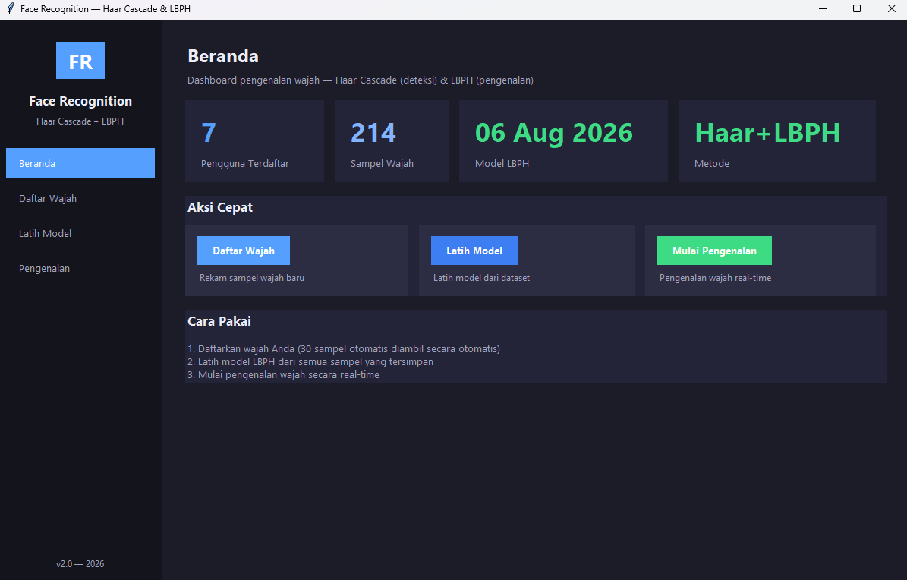
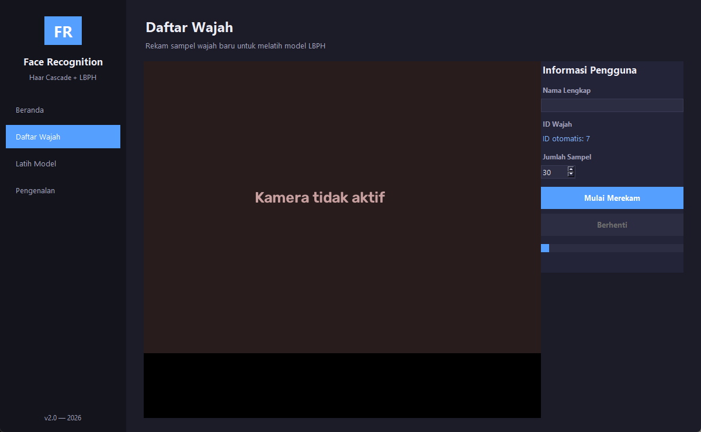
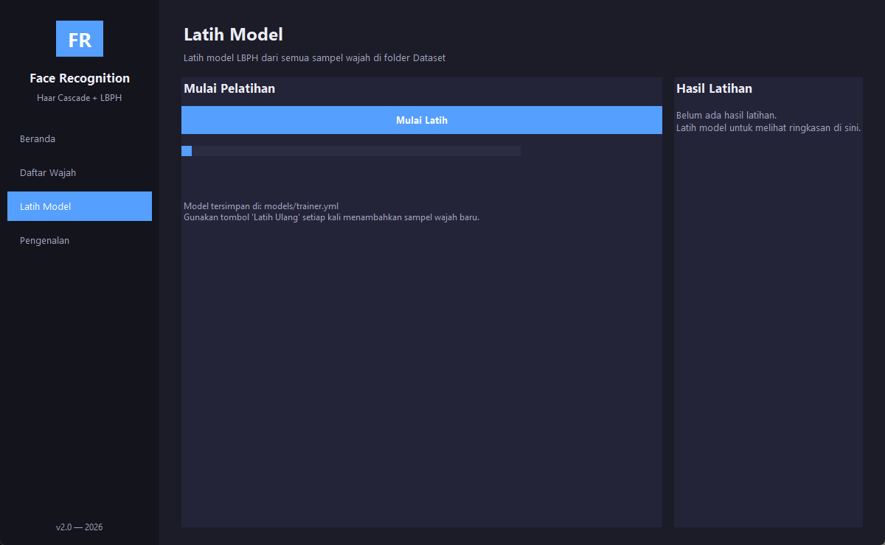
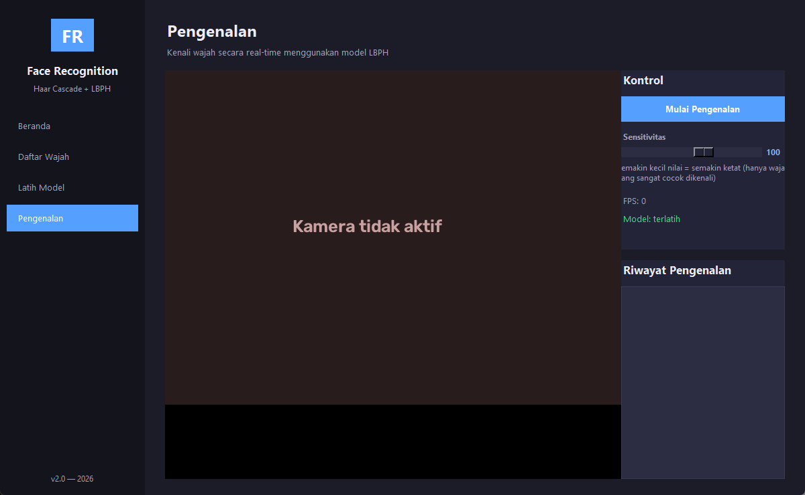

# Face Recognition — Haar Cascade & LBPH

Aplikasi GUI pengenalan wajah dengan **deteksi Haar Cascade** dan **pengenalan LBPH (Local Binary Pattern Histogram)**. Diupgrade pada 2026 dari versi awal (2021) menjadi aplikasi modern bergaya dark UI dengan database pengguna, filter kualitas gambar, dan pengenalan real-time.

## Fitur

- 🎨 **GUI modern** (Tkinter, tema gelap) dengan sidebar navigasi
- 👤 **Daftar Wajah** — rekam sampel wajah dengan pratinjau webcam langsung
  - Hanya menyimpan foto yang **tajam** (penyaringan blur otomatis)
  - Ukuran & kontras diseragamkan otomatis (CLAHE + resize)
  - Jumlah sampel bisa diatur (default 30)
- 🧠 **Latih Model** — latih model LBPH dari dataset dengan progress bar real-time
- 📸 **Pengenalan** — kenali wajah secara real-time
  - Menampilkan nama, persentase kemiripan, dan riwayat pengenalan
  - Pengaturan sensitivitas, indikator FPS
- 💾 **Database pengguna** (`data/users.json`) — tidak perlu mengubah kode saat menambah orang

## Screenshot

**Beranda**


**Daftar Wajah** · **Latih Model** · **Pengenalan**




## Cara Menjalankan

1. Install Python 3.10+ lalu pasang dependensi:

   ```
   pip install -r requirements.txt
   ```

   > Catatan: wajib `opencv-contrib-python` (bukan `opencv-python`) karena LBPH berada di modul `cv2.face`.

2. Jalankan aplikasi:

   ```
   python app.py
   ```

3. Ikuti alur: **Daftar Wajah** → **Latih Model** → **Pengenalan**.

## Struktur Folder

```
app.py               # entry point aplikasi
core/                # logika inti (deteksi, rekam, latih, kenali, DB)
gui/                 # antarmuka Tkinter (tema, widget, halaman)
assets/              # haarcascade_frontalface_default.xml
Dataset/             # sampel wajah (User.<id>.<n>.jpg)
models/              # model hasil latihan (trainer.yml)
data/users.json      # daftar ID → nama pengguna
legacy/              # script versi lama (2021)
```

## Metode yang Digunakan

- **Deteksi**: `CascadeClassifier` (Haar Cascade) dari file `haarcascade_frontalface_default.xml`
- **Pengenalan**: `cv2.face.LBPHFaceRecognizer` dengan radius=1, neighbors=8, grid 8×8

## Referensi

- <https://www.bogotobogo.com/python/OpenCV_Python/python_opencv3_Image_Object_Detection_Face_Detection_Haar_Cascade_Classifiers.php>
